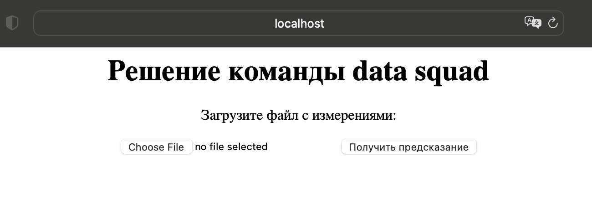
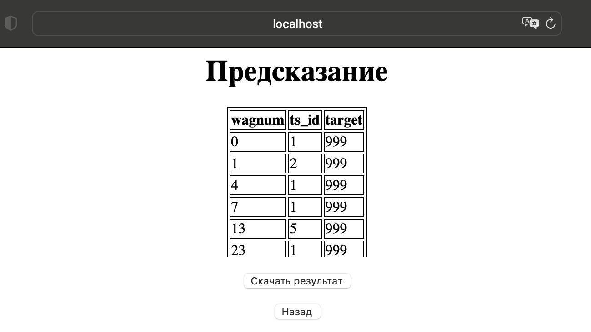

# besthack

The solution for semifinal of bestHack by data squad team

***

## Installation and running

<ins>**0. Requirements:**</ins>

The web scrypt requires python modules `pandas`, `joblib` and `scikit-learn` and `pyarrow` or `fastparquet` to decode .parquet files

<ins>**1. Download the repository:**</ins>

```
git clone https://github.com/Ronningen/besthack
```

<ins>**2. Run the server:**</ins>

#### Linux, MacOS

```
cd web
chmod a+x cgi-bin/resultpage.py
chmod a+x cgi-bin/download.py
python3 -m http.server --cgi
```

#### Windows

```
cd web
python3 server.py
```

<ins>**3. Open the web page:**</ins>

http://localhost:8000/mainpage.html

***

## How it should look

#### Main page



#### Page with results


